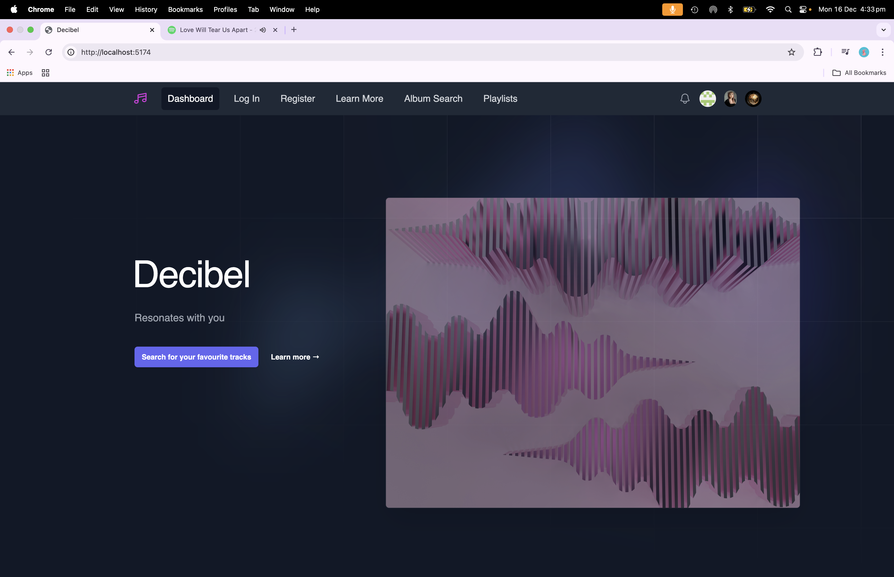
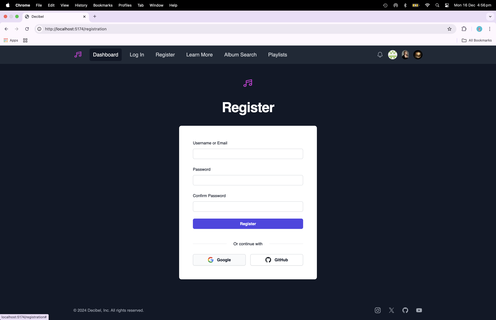
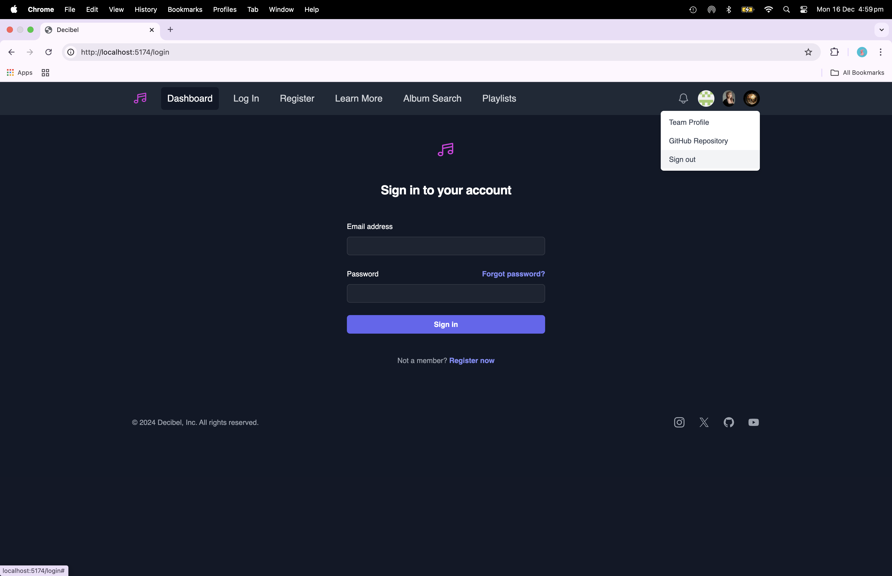
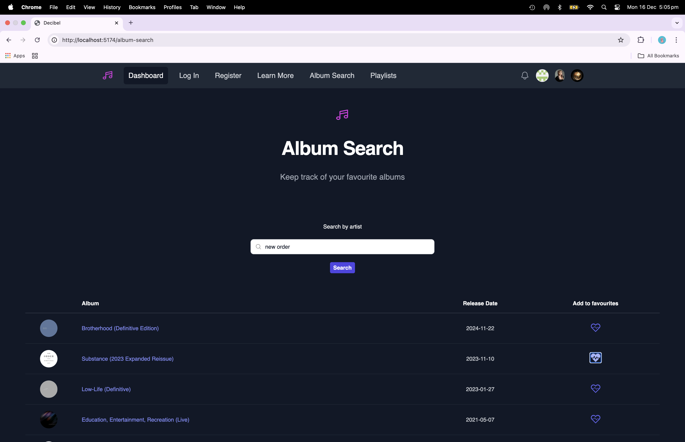
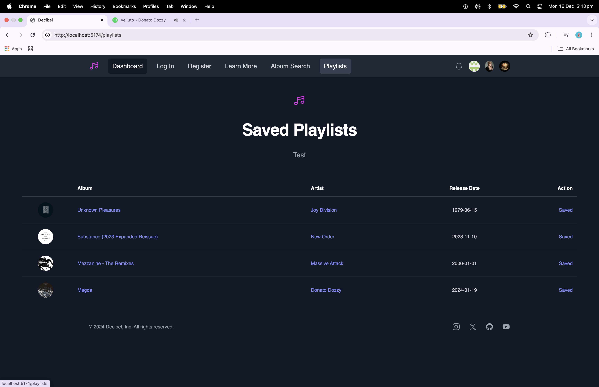
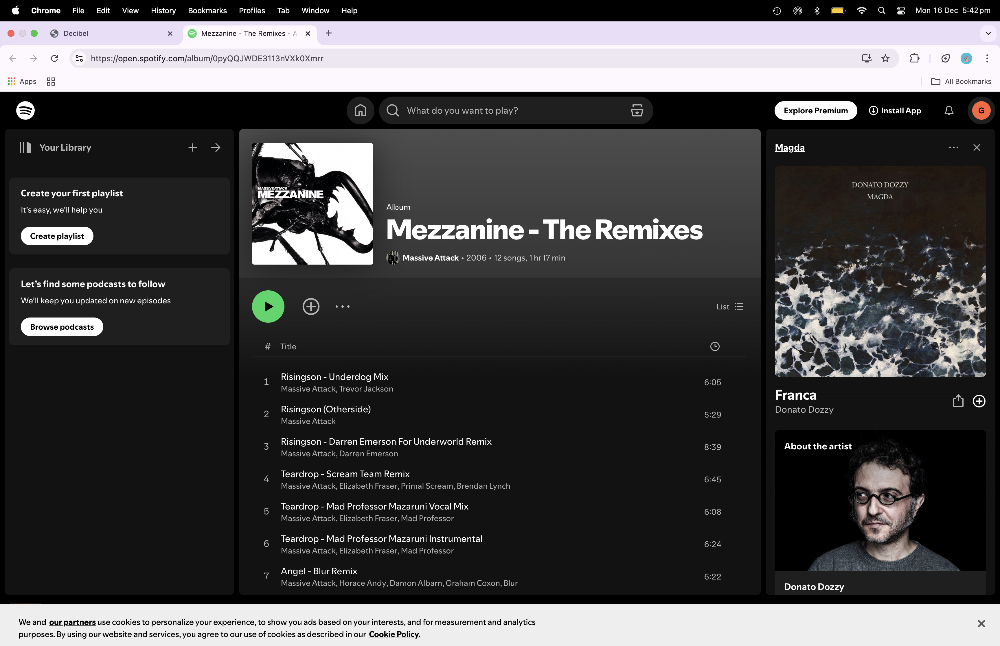

# decibel-spa

## Table of Contents

- [Description](#description)
- [Installation](#installation)
- [Usage](#usage)
- [License](#license)
- [Contributing Guidelines](#contributing-guidelines)
- [Testing](#testing)
- [Authors and Acknowledgements](#authors-and-acknowledgements)

## Description

A collaborative full-stack single page app of a music streaming service using React + Vite + Tailwind CSS + PostgreSql + Sequelize ORM, that calls the Spotify API, and allows a user to register/login and subsequently listen to an artist/song/album and create/delete a playlist.

# Installation

1. React with Typecript:

```zsh

npm create vite@latest decibel-spa

select a framework: > React

select a variant: > Typecript

cd decibel-spa

npm install

npm run dev

```

2. Delete App.css and install Tailwind CSS, configure template paths: 

```zsh

  npm install -D tailwindcss postcss autoprefixer

  npx tailwindcss init -p

 export default {
      content: [
        "./index.html",
        "./src/**/*.{js,ts,jsx,tsx}",
      ],
      theme: {
        extend: {},
      },
      plugins: [],
    }

```

3. Add @tailwind directives to index.css:

@tailwind base;

@tailwind components;

@tailwind utilities;

4. Install react-router-dom @tailwindcss/forms @tailwindcss/line-clamo

```zsh

npm install react-router-dom @tailwindcss/forms @tailwindcss/line-clamp

```

5. Install @heroicons/react package:

```zsh

npm install @heroicons/react

```

6. Clone the repository:

```zsh

git clone git@github.com:Mjoel54/decibel-spa.git

```
7. The folder structure follows the separation of concerns design principle: root, client, server

8. Install dependencies required for root/server/client

root package.json:

``` zsh

npm install express

```

client package.json:

```zsh

npm install jwt-decode pg pg-hstore react react-dom react-router-dom tailwind-scrollbar

```

server package.json

```zsh

npm install @types/sequelize bcrypt cors dotenv express jsonwebtoken pg sequelize sequelize-typescript

```
9. Root:

```zsh
npm run build

npm run seed

npm run start:dev

```
10. Render:

Build command: npm run render-build

Start command: npm start


## Usage

Link to render deployment:

[decibel-spa](https:/decibel-spa ... on render.com)

Screenshots of app demonstrating functionality:

### screenshot-1



### screenshot-2



### screenshot-3



### screenshot-4



### screenshot-5



### screenshot-6



## License

[](https://opensource.org/licenses/MIT)

## Contributing Guidelines

Create a new branch for the commit and start a pull request.

## Testing

## Authors and Acknowledgements

[email] (ginadrcoder@gmail.com)

[email] (mitchjoelklein@hotmail.com)

## Questions

For enquiries, please contact me at:

[email] (ginadrcoder@gmail.com)

[github] (https://github.com/gina-t)

[email] (mitchjoelklein@hotmail.com)

[github] (https://github.com/Mjoel54)

[github] (https://github.com/kostcon)
